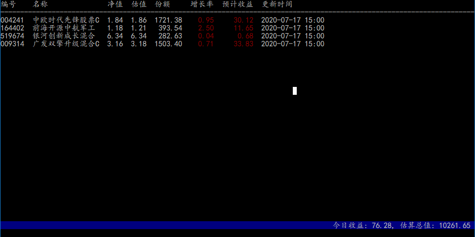

# 投资有风险 入市需谨慎


### 编译

``` sh
git clone https://github.com/hanhan-GKD/BigMoney.git
cd BigMoney
cd ../ && mkdir build
cd build && cmake ../BigMoney
make -j16
```

### 使用
```
1. 添加/更新基金 
update <基金编号> <持有份额>
2. 删除基金
delete <基金编号>
3. 退出程序
quit
4. 帮助
help
```
 
### 适配

- [x] Windows
- [x] linux
- [ ] MacOs

###  祝大家早日发财
